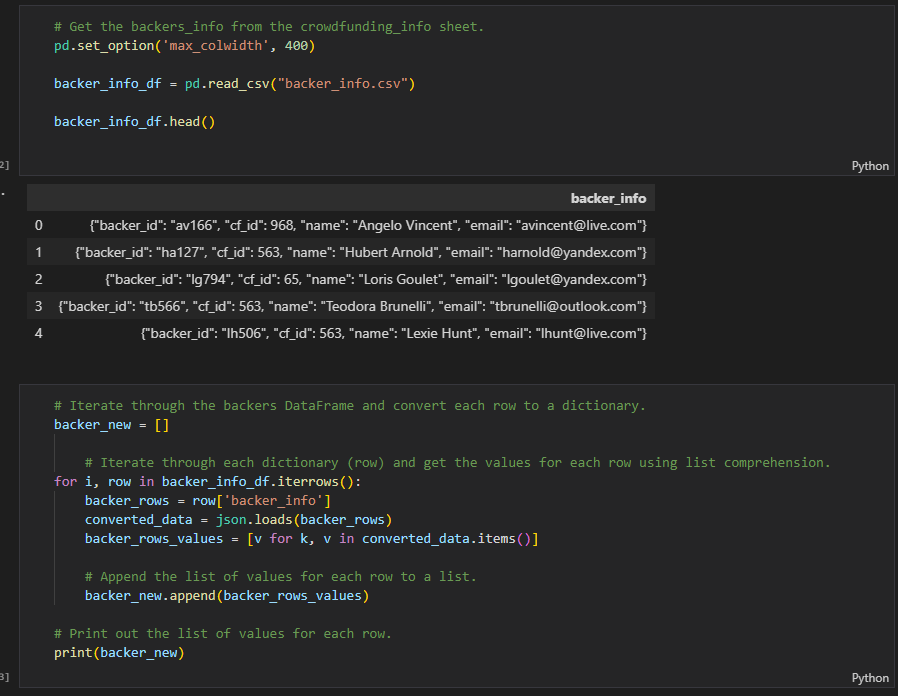

# Crowdfunding-ETL
---
## Project Overview: 
The purpose of this challenge was to extract, transform, and load crowdfunding data by using Python, Pandas, and Jupyter Notebook. After the data is prepared, SQL will be used to create queries to analyize the relationships between the data.

---

## ETL Process:

The first step was extract and transform the data. The backer_info.csv was imported and converted into a dataframe by iterating through the raw csv data and then extracting the data into a new dataframe using Pandas. 

Once the data was in a new useable dataframe, I was able to split the "name" column into "first_name" and "last_name" columns using the string split method. The original "name" column was then droped and then new data frame was then expored as a new csv ready to be loaded into SQL. 

The final step in the ETL process is to load the data by creating an ERD and schema table. This will help us understand the relationship between the data as well as hold primary and foreighn keys based on the information from our new csv file, backers.csv. Below is the diagram displaying the inter-relationships between each csv file using PostgreSQL.

Now the data was ready to be uploaded into SQL. A schema for each table is created with their respective data uploaded successfully. Each primary and foreign key are defined as well as the alter table statements.

---
#### Data resources:
CSV Files: [backers.csv](Data/backers.csv)
Schema Files: [crowdfunding_db_schema.sql](crowdfunding_df_schema.sql)
Python Files: [Extract-Transform_final_code.ipynb](Extract-Transform_final_code.ipynb), [crowdfund_etl.ipynb](crowdfund_etl.ipynb)

